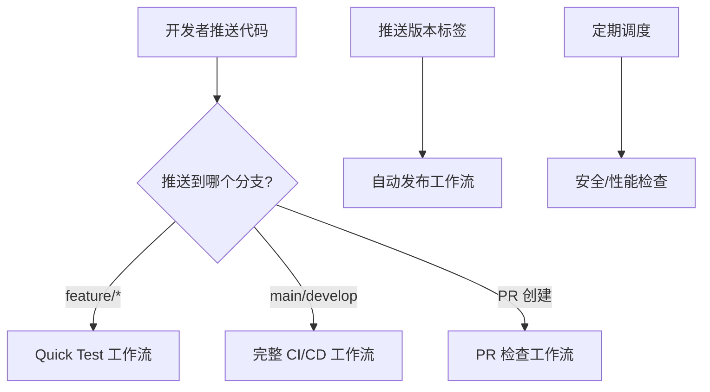

# 持续集成(CI/CD) 部署指南

## 🎯 什么是持续集成？

**持续集成(Continuous Integration, CI)** 是一种开发实践，团队成员频繁地集成他们的工作，通常每个人每天至少集成一次。每次集成都通过自动化构建来验证，从而尽快地发现集成错误。

### CI/CD 的核心流程：
```
开发者提交代码 → 触发自动构建 → 运行测试 → 代码质量检查 → 部署(如果所有检查通过)
```

## 🚀 DesktopPet 项目的 CI/CD 部署步骤

### 第一步：创建功能分支部署 CI 配置

```bash
# 1. 确保你在最新的 main 分支
git checkout main
git pull origin main

# 2. 创建新的功能分支
git checkout -b feature/setup-github-actions

# 3. 添加所有 GitHub Actions 文件
git add .github/
git add check-ci-setup.*
git add .gitignore

# 4. 提交更改
git commit -m "feat: Add GitHub Actions CI/CD pipeline

- Add main CI/CD workflow for multi-platform builds
- Add quick test workflow for feature branches  
- Add auto-release workflow for version tags
- Add security and performance testing
- Add configuration check scripts"

# 5. 推送分支到远程
git push origin feature/setup-github-actions
```

### 第二步：创建 Pull Request 测试

1. **在 GitHub 上创建 PR**:
   - 去你的 GitHub 仓库
   - 点击 "Compare & pull request"
   - 标题: `Add GitHub Actions CI/CD Pipeline`
   - 描述可以写:
   ```markdown
   ## 🎯 目标
   为 DesktopPet 项目添加完整的 CI/CD 流水线
   
   ## 📋 新增功能
   - ✅ 多平台自动构建 (Windows/Linux/macOS)
   - ✅ 自动化测试执行
   - ✅ 代码质量检查
   - ✅ 安全扫描
   - ✅ 性能测试
   - ✅ 自动发布系统
   
   ## 🧪 测试计划
   - [ ] CI 配置语法正确
   - [ ] 构建流程正常运行
   - [ ] 测试可以正确执行
   - [ ] 工作流之间没有冲突
   
   ## 📝 注意事项
   这是初始 CI/CD 配置，可能需要根据实际运行情况进行微调。
   ```

2. **观察 CI 运行情况**:
   - PR 创建后会自动触发 `quick-test.yml` 和 `security.yml`
   - 你可以在 "Actions" 标签页看到运行状态
   - 如果有错误，可以查看日志并修复

### 第三步：修复和调试（如果需要）

如果 CI 运行失败，按以下步骤修复：

```bash
# 1. 查看 GitHub Actions 的错误日志
# 2. 在本地修复问题
git add .
git commit -m "fix: 修复 CI 配置问题"
git push origin feature/setup-github-actions

# 3. 推送后会自动重新运行 CI
```

### 第四步：合并到 main 分支

当所有检查都通过后：

```bash
# 1. 在 GitHub 上合并 PR (推荐)
# 或者在本地合并：

git checkout main
git pull origin main
git merge feature/setup-github-actions
git push origin main

# 2. 删除功能分支
git branch -d feature/setup-github-actions
git push origin --delete feature/setup-github-actions
```

## 📊 **CI/CD 工作流程详解**

### 工作流触发时机：



### 每个工作流的作用：

| 工作流 | 触发条件 | 运行时间 | 主要功能 |
|--------|----------|----------|----------|
| `quick-test.yml` | feature 分支推送 | 3-5分钟 | 快速构建验证 |
| `ci.yml` | main/develop 推送、PR | 10-15分钟 | 完整构建测试 |
| `release.yml` | 版本标签推送 | 15-25分钟 | 多平台发布包 |
| `security.yml` | 定期/main推送 | 5-8分钟 | 安全扫描 |
| `performance.yml` | 定期/重要推送 | 8-12分钟 | 性能测试 |

## 🛡️ **分支保护最佳实践**

建议在 GitHub 上设置分支保护规则：

1. **进入仓库设置**: Settings → Branches
2. **添加规则**: Add rule
3. **分支名称**: `main`
4. **启用以下选项**:
   - ✅ Require a pull request before merging
   - ✅ Require status checks to pass before merging
   - ✅ Require branches to be up to date before merging
   - ✅ Include administrators

## 🎯 **日常开发工作流**

### 功能开发流程：
```bash
# 1. 创建功能分支
git checkout -b feature/new-awesome-feature

# 2. 开发代码...
# 3. 提交并推送
git add .
git commit -m "feat: 添加新的酷炫功能"
git push origin feature/new-awesome-feature
# → 触发 quick-test.yml

# 4. 创建 PR 到 main
# → 触发 ci.yml 完整测试

# 5. 代码审查通过后合并
# → 合并后可能触发更多检查
```

### 发布流程：
```bash
# 1. 确保 main 分支稳定
# 2. 创建版本标签
git tag v1.0.0
git push origin v1.0.0
# → 触发 release.yml 自动发布

# 3. 检查 GitHub Releases 页面确认发布成功
```

## 🔧 **实用提示**

### 查看 CI 状态的方法：
1. **GitHub 网页**: 仓库首页会显示最新的 CI 状态
2. **PR 页面**: 每个 PR 都会显示检查状态
3. **Actions 标签页**: 查看所有工作流的历史记录
4. **命令行**: 使用 GitHub CLI
   ```bash
   gh run list
   gh run view [run-id]
   ```

### 调试 CI 的技巧：
1. **查看详细日志**: 点击失败的步骤查看具体错误
2. **本地复现**: 尽量在本地运行相同的命令
3. **逐步启用**: 先禁用复杂的检查，逐步启用
4. **使用调试模式**: 在工作流中添加 `ACTIONS_STEP_DEBUG: true`

## ❓ **常见问题解答**

**Q: 第一次部署 CI 配置应该用什么分支？**  
A: 建议使用 `feature/setup-ci` 或 `feature/github-actions` 分支，先测试再合并。

**Q: CI 失败了怎么办？**  
A: 查看错误日志，在本地修复后重新推送，CI 会自动重新运行。

**Q: 可以跳过 CI 检查吗？**  
A: 可以在提交信息中添加 `[skip ci]`，但不推荐在重要分支上使用。

**Q: CI 运行太慢怎么办？**  
A: 使用缓存、并行构建、或者为不同类型的更改创建不同的工作流。

---

总结：**先在功能分支上测试 CI 配置，确认无误后再合并到 main 分支**。这是最安全和最佳的实践方式！
