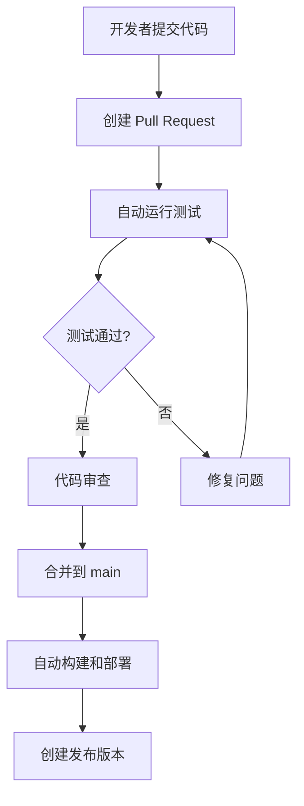

# DesktopPet CI/CD 快速入门

## 🚀 5分钟快速开始

### 1. 理解我们的 CI/CD 流程



### 2. 日常开发流程

#### 创建新功能
```bash
# 1. 切换到主分支并更新
git checkout main
git pull origin main

# 2. 创建功能分支
git checkout -b feature/my-awesome-feature

# 3. 开发你的功能
# ... 编写代码 ...

# 4. 提交更改
git add .
git commit -m "feat: add awesome feature"

# 5. 推送分支
git push origin feature/my-awesome-feature
```

#### 创建 Pull Request
1. 在 GitHub 上点击 "New Pull Request"
2. 等待 CI 检查完成 ✅
3. 请求团队成员审查
4. 合并到 main 分支

### 3. CI/CD 会自动做什么？

#### 当你创建 PR 时：
- ✅ 编译检查
- ✅ 运行单元测试
- ✅ 代码格式检查
- ✅ 基础安全扫描

#### 当代码合并到 main 时：
- 🔨 多平台构建（Windows/Linux/macOS）
- 🧪 完整测试套件
- 📊 性能测试
- 📋 生成文档

#### 当你创建版本标签时：
- 📦 构建发布版本
- 🚀 创建 GitHub Release
- 📎 上传安装包

### 4. 如何创建发布版本

```bash
# 创建版本标签
git tag -a v1.0.0 -m "Release version 1.0.0"
git push origin v1.0.0

# CI 会自动：
# - 构建发布版本
# - 创建 GitHub Release
# - 上传 .exe 文件
```

### 5. 查看 CI/CD 状态

#### 在 GitHub 上：
1. 进入仓库页面
2. 点击 "Actions" 标签
3. 查看工作流运行状态

#### 常见状态：
- 🟢 **成功**：一切正常
- 🔴 **失败**：需要修复问题
- 🟡 **进行中**：正在运行
- ⚪ **跳过**：条件不满足

### 6. 故障排除

#### 构建失败了怎么办？
1. 点击失败的工作流
2. 查看详细日志
3. 本地重现问题：
   ```bash
   # 本地构建测试
   cmake --preset=mingw
   cmake --build --preset=mingw
   
   # 运行测试
   ctest --preset=mingw
   ```

#### 测试失败了怎么办？
1. 确保本地测试通过
2. 检查测试数据是否正确
3. 修复代码并重新推送

### 7. 最佳实践

#### 提交信息规范
```bash
# 好的提交信息
git commit -m "feat: add pet feeding system"
git commit -m "fix: resolve memory leak in animation"
git commit -m "docs: update README with new features"

# 避免的提交信息
git commit -m "update"
git commit -m "fix bug"
git commit -m "wip"
```

#### 分支命名
```bash
# 推荐
feature/pet-feeding-system
bugfix/animation-memory-leak
hotfix/critical-crash-fix

# 避免
my-branch
test
temp
```

### 8. 有用的检查工具

#### 本地 CI 检查脚本
```bash
# Windows
.\check-ci-setup.bat

# Linux/macOS
./check-ci-setup.sh
```

#### 手动运行常见检查
```bash
# 检查代码格式
clang-format --dry-run --Werror src/**/*.cpp

# 运行静态分析
cppcheck --enable=all src/

# 检查 CMake 配置
cmake --preset=mingw --dry-run
```

## 📞 需要帮助？

- 🐛 **遇到 Bug**：创建 Issue
- 💡 **有建议**：创建 Discussion
- 🆘 **紧急问题**：联系团队负责人

---

*记住：CI/CD 是来帮助你的，不是来为难你的！如果有任何问题，随时寻求帮助。*
